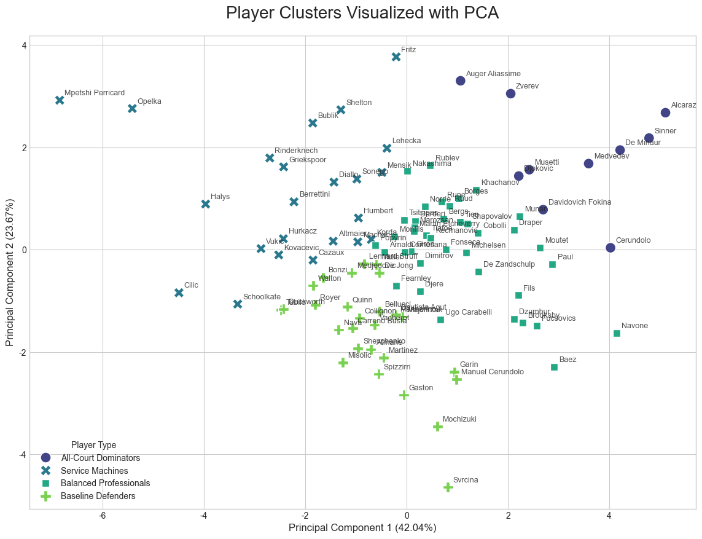

### 💻 程式碼與分析過程
GitHub 預覽可能無法完整顯示，請點擊下方按鈕查看完整的 Notebook 分析與互動圖表：

[](https://nbviewer.org/github/YuJunWang/Tennis-Player-Clustering/blob/main/notebooks/TennisDataAnalysis.ipynb)


# 🎾 ATP Tennis Player Style Clustering

> **"Data reveals the DNA of playing styles beyond the naked eye."**


### 📊 Unsupervised Learning & 6-Dimensional Radar Analysis

*(基於 K-Means 與六維雷達圖的 ATP 選手風格解析)*


[](https://www.python.org/)

[](https://scikit-learn.org/)

[]()


## 📖 專案背景 (Project Overview)

網球比賽中，我們常說某位選手是「發球大砲」或「底線型選手」，但這些標籤往往流於主觀。

本專案透過爬取 **Tennis Abstract** 的高階數據，利用 **K-Means 分群演算法**，將原本複雜的比賽數據轉化為客觀的四大風格類型。


我們不只看勝率，更建立了 **六大能力維度 (6-Point Radar Metrics)**，精準描繪出每位選手的「能力指紋」。


## 🔍 數據來源與挑戰 (Data \& Challenges)

* **Source**: [Tennis Abstract Leaders](https://www.tennisabstract.com/)

* **Constraint**: 該網站設有嚴格的反爬蟲機制 (Anti-Scraping) 與真人驗證，且會封鎖雲端伺服器 IP (如 Google Colab)。

* **Solution**: 

   1. **Local Execution**: 不使用雲端架構，改為在本地端架構執行環境。

   2. **Selenium**: 模擬真實瀏覽器行為 (Human-like interactions) 以通過驗證機制。

   3. **Snapshot**: 成功抓取並整合 ATP Top 100 選手數據 (Snapshot: 2025-12-24)。


## ⚠️ 執行注意事項 (Execution Note)

本專案的爬蟲腳本 (`notebooks/`) **無法在 Google Colab 或其他雲端環境直接執行**。

由於目標網站會偵測 Data Center IP，請務必在 **本地端 (Local Machine)** 執行，並確保已安裝對應的 Chrome Browser 與 Driver。


> **Note for Developers**: 

> The scraping notebook requires a **local environment** to run. Cloud environments like Google Colab will trigger the site's anti-bot verification immediately.


> 📥 **完整專案報告 (Full Presentation)**
> [**📄 Download Project Report (PDF)**](docs/Tennis_Analysis_Report_20251014.pdf?raw=true)


## 🧬 核心發現：四大選手類型 (The 4 Archetypes)

雖然 Elbow Method 呈現平滑趨勢，但結合 **網球領域知識 (Domain Knowledge)** 後，我們選定 **K=4** 為最佳模型參數，能最精確地對應現實比賽中的四種戰術風格。


### 1. 👑 全能型統治者 (All-Court Dominators)

* **代表選手**: Jannik Sinner, Carlos Alcaraz

* **特徵**: 在雷達圖上覆蓋面積最大。無論是發球得分率 (SPW) 或接發球得分率 (RPW) 均高於平均，展現了無懈可擊的宰制力。


### 2. 🚀 發球機器 (Service Machines)

* **代表選手**: Ben Shelton, Alexander Bublik

* **特徵**: **Serve Power (Ace%)** 極端突出，圖形在上方呈現尖銳突起。雖然發球局強勢，但接發球效率相對較低，依賴 "Servebot" 戰術得分。


### 3. 🛡️ 底線防守者 (Baseline Defenders)

* **代表選手**: Sebastian Baez, Alex de Minaur

* **特徵**: 發球力量較弱，但擁有極高的 **Return Efficiency (RPW)**。他們擅長在底線多拍來回中磨死對手，是典型的「磨教」信徒。


### 4. ⚖️ 均衡型中堅 (Balanced Professionals)

* **代表選手**: Taylor Fritz, Casper Ruud

* **特徵**: 雷達圖形狀最接近正六邊形，各項數值緊貼平均線。這群選手沒有明顯短板，是巡迴賽中的中流砥柱。


## 📸 視覺化分析 (Visualizations)

*(Latest Execution Snapshot: 2025-12-24)*


### 📌 1. 選手風格雷達圖 (Player Style Radar)

利用 K-Means 分出的四大類別，在六維雷達圖上呈現出截然不同的幾何特徵。

*(下圖展示了全能型與發球型選手的顯著差異)*


### 📌 2. PCA 分群分佈 (Cluster Distribution)

透過 PCA 降維檢視，可見四種風格在向量空間中具備清晰的決策邊界。





## 🛠️ 分析方法 (Methodology)

我們定義了以下六個維度來構建雷達圖，全方位評估選手能力：

1.  **Serve Stability**: 一發得分率 (SPW)

2.  **Serve Power**: Ace 球率 (Ace%)

3.  **Serve Control**: 發球控制力 (100 - 雙誤率 DF%)

4.  **Return Efficiency**: 接發球得分率 (RPW)

5.  **Break Threat**: 破發率 (Brk%)

6.  **Match Experience**: 總場次經驗 (Matches)


## 📂 專案結構 (Structure)

```text

Tennis-Player-Clustering/

├── data/               # Raw Data (2025-12-24 Snapshot)

├── docs/               # Full Analysis Report (PDF)

├── notebooks/          # Clustering Logic & Radar Chart Generation

├── images/             # Result Visualizations (Radar Charts, PCA)

├── requirements.txt    # Dependencies

└── README.md           # Documentation
```


## 🛠️ 使用技術 (Tech Stack)


* **Programming**: Python 3.10+


* **AI/LLM**: Google Gemini


* **Data Processing**: Pandas, Openpyxl


* **Crawling**: Selenium, BeautifulSoup4


## 👤 作者 (Author)


**王譽鈞 (YuJunWang)**


* Data Engineer / Data Scientist / AI-Augmented Developer 


* [GitHub Profile](https://github.com/YuJunWang)

